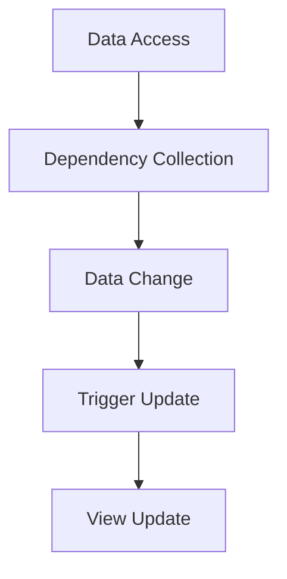

# In-depth Understanding of Vue 3 Reactivity

Vue 3’s reactivity system uses Proxy for data interception, greatly improving performance and flexibility. This article will analyze the principles, code implementation, and application scenarios in detail.

## Reactivity System Principles

Vue 3 uses `Proxy` instead of Vue 2’s `Object.defineProperty`, enabling comprehensive listening for objects and arrays.

```js
const data = { count: 0 }
const proxy = new Proxy(data, {
  get(target, key) {
    // Dependency collection
    return target[key]
  },
  set(target, key, value) {
    // Trigger updates
    target[key] = value
    return true
  },
})
```

## Dependency Collection and Update Triggering

The core of the reactivity system is dependency collection and update triggering. Whenever data is accessed, the system records dependencies; when data changes, it notifies related dependencies to update.

- **Dependency Collection**: Recorded via getter.
- **Update Triggering**: Notified via setter.

## Practical Application Scenarios

### Two-way Binding for Form Data

```vue
<template>
  <input v-model="form.name" />
</template>

<script setup>
import { ref } from 'vue'
const form = ref({ name: '' })
</script>
```

### Reactive Nested Objects

```js
const state = reactive({
  user: {
    info: {
      name: 'John',
      age: 25,
    },
  },
})
```

## Reactivity Flow Diagram

Below is a flowchart illustrating the core process of Vue 3 reactivity:



## Performance Optimization

Vue 3’s reactivity system shows significant performance improvements, especially with large data sets and complex nested structures. Proxy’s lazy listening and deep proxy mechanism perform excellently.

## Conclusion

The reactivity principles of Vue 3 bring more efficient and flexible data management to frontend development. Understanding its underlying mechanism helps you build high-performance and maintainable applications.
